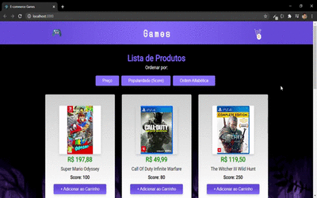

<h1 align="center">E-commerce de Games</h1>

<h2 align="center">Projeto simples de E-commerce para Games de consoles.</h2>

<i>Interface no desktop.</i>

<h3 align="center"> Projeto concluído, porém eventualmente posso adicionar algumas features nele. </h3>

Esse projeto foi um desafio pra mim, pois muitos conceitos de Javscript são fortíssimos aqui, e foi interessante aperfeiçoar esses conhecimentos.

Foi utilizado React nesse projeto, mas de uma maneira bem simples.

Se quiser somente visualizá-lo, pode acessá-lo <a href="https://inspiring-snyder-8dfdc3.netlify.app">aqui.</a>

<h3 align="center">Descrição do projeto</h3>

O projeto consiste de um E-commerce bem simples onde se é possível:

<ul>
  <li>Adicionar produtos ao carrinho</li>
  <li>Remover produtos do carrinho</li>
  <li>Organizar os produtos por preço, ordem alfabética ou Score</li>
  <li>Novas inclusões conforme for achando interessante</li>
  <li>Site responsivo</li>
</ul>

<h3>Melhorias a serem implementadas</h3>
<ul>
  <li>Modal do carrinho responsivo ✅</li>
  <li>Resolver esse Bug infeliz da ordenação de lista ✅</li>
  <li>Deixar os ítens comprados salvos no localStorage</li>
</ul>

<h3>Para clonar a aplicação e rodar localmente</h3>

Primeiramente deve-se fazer o <strong>Fork</strong> do repositório, depois execute esse comando na raiz da pasta da aplicação pelo Bash ou linha de comando qualquer:

<code>npm install</code>

Com isso o npm puxará todos os pacotes necessários para a aplicação junto de suas dependências.

Com tudo pronto só executar o comando abaixo, também na pasta raiz do projeto:

<code>npm run start</code>
